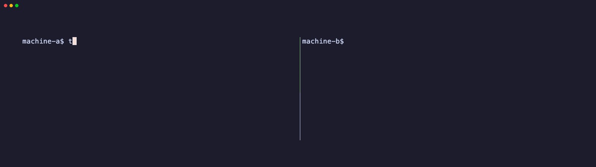

<p align="center">
  <br>
  
  
  
  
  
</p>

<h1 align="center">Tubo</h1>

<p align="center">
  <b>The fastest way to move files between two machines.</b><br>
  No accounts. No config. No root. End-to-end encrypted. Always.
</p>

<br>

<p align="center">
  
</p>


---

## Why Tubo?

Most file transfer tools either require accounts (WeTransfer, Google Drive), expose data to the server (scp through a jumphost), or need root to install (rsync, netcat).

Tubo is different:

- **True E2E Encryption** — The server is a blind pipe. It relays encrypted bytes it cannot read. The key never leaves your machines.
- **Zero-Install Mode** — SSH'd into a production server with no tools? Use `curl | sh`. It works with just `curl` and `openssl`.
- **No Root, No Accounts** — The binary goes in `~/.local/bin`. No sign-ups, no API keys, no config files.
- **Directories & Compression** — Stream entire folders on-the-fly with `--compress`. No temporary zip files.
- **Integrity Verified** — SHA-256 checksum compared automatically after every transfer.

---

## Quick Start

### Install (one-liner, no root)

```sh
curl -sL https://tubo.endlessite.com/get | sh
```

### Send a file

```bash
tubo send backup.sql
```

Copy the token it prints, then on the other machine:

### Receive

```bash
tubo receive e4f2a1-8xZpL9q4-aB3k9Xm2pQ7rT1wZ
```

### Send a directory (compressed)

```bash
tubo send ./my-project --compress
```

### Pipe from stdin

```bash
echo "secret message" | tubo send -
```

---

## The POSIX Superpower (Zero-Install)

The ultimate goal of Tubo is to work **everywhere**, especially where other tools fail. 

Are you SSH'd into a locked-down production server where you **can't install binaries** (no root, `noexec` mounts, strict corporate policies)? Just use the fallback script:

**Send:**
```sh
curl -sL https://tubo.endlessite.com/run | sh -s send database.sql e4f2a1-8xZpL9q4-aB3k9Xm2pQ7rT1wZ
```

**Receive:**
```sh
curl -sL https://tubo.endlessite.com/run | sh -s receive e4f2a1-8xZpL9q4-aB3k9Xm2pQ7rT1wZ
```

This script does **not** download a binary executable. It relies purely on `curl` and `openssl` — tools that already exist on almost every UNIX system. It runs directly in memory on any POSIX-compliant shell (`sh`, `bash`, `zsh`, `dash`, `ash`) without triggering execution blocks.

**Is `curl | sh` safe?** You can always download the script first with `curl -sL https://tubo.endlessite.com/run -o run.sh`, read the code, then run `sh run.sh receive <token>`. The script is [150 lines of simple shell](run.sh) — we encourage you to audit it.

### The Pure Bash Proof (No Scripts at all)

If you don't even want to run our `run.sh` wrapper, you can pipe `curl` directly into `openssl`. 
Given a token `ID-PASSWORD-KEY`, you derive the AES-256 key and IV using SHA-512(KEY). Then you run:

**Send manually:**
```sh
cat database.sql \
  | openssl enc -e -aes-256-ctr -K "$AES_KEY" -iv "$AES_IV" \
  | curl --data-binary @- -H "X-File-Name: database.sql" -u "tubo:$PASSWORD" "https://tubo.endlessite.com/$ID"
```

**Receive manually:**
```sh
curl -u "tubo:$PASSWORD" "https://tubo.endlessite.com/$ID" \
  | openssl enc -d -aes-256-ctr -K "$AES_KEY" -iv "$AES_IV" > database.sql
```
This proves Tubo is just standard AES-256-CTR streaming over HTTP!

---

## Self-Hosting

Don't want to use our public relay? Run the open-source relay in 30 seconds:

```bash
cd server
mvn clean package
java -jar target/server-1.0.0-SNAPSHOT-fat.jar
```

Then point your CLI to it (once):

```bash
tubo config server your-server.com:8080
```

The relay server requires Java 17+ and ~10MB of RAM. It stores nothing on disk.

Set the `PORT` environment variable to change the listening port: `PORT=443 java -jar server.jar`

---

## How It Works

```
┌──────────┐       ┌─────────────────┐       ┌──────────────┐
│  Sender  │──────▶│  Relay Server   │──────▶│   Receiver   │
│          │       │  (blind pipe)   │       │              │
│ AES-256  │       │ Cannot decrypt  │       │  AES-256     │
│ encrypt  │       │ Zero disk I/O   │       │  decrypt     │
└──────────┘       └─────────────────┘       └──────────────┘
```

The transfer token format is `ID-PASSWORD-KEY`:

| Part | Purpose | Sent to server? |
|---|---|---|
| `ID` | Identifies the session | ✅ |
| `PASSWORD` | Authenticates both peers | ✅ |
| `KEY` | E2EE secret for AES-256-CTR | ❌ **Never** |

1. One peer creates a session and gets back `ID` + `PASSWORD` from the server
2. It generates a random `KEY` locally and combines everything into a token
3. The other peer connects using the `ID` and `PASSWORD` to authenticate
4. Data is encrypted with `AES-256-CTR(SHA-512(KEY))` — the server only sees ciphertext
5. A SHA-256 checksum is compared at the end to verify integrity

**The relay server is intentionally stateless.** It never writes to disk, never logs file contents, and never sees the encryption key. You can verify this yourself — the entire server is [a single Java file](server/src/main/java/com/endlessite/server/MainVerticle.java).

---

## Why not just use croc?

[croc](https://github.com/schollz/croc) is a great tool. If you already have it installed on both machines, use it.

But here's the thing — **you often can't install it**. And that's where Tubo was born:

**The scenario**: You're SSH'd into a production server. You need to pull a 5GB log file. The `/tmp` partition is mounted as `noexec`. You don't have root. Corporate policy actively blocks the execution of unknown binaries. 

With croc, you are completely stuck. With Tubo:

```sh
curl -sL https://tubo.endlessite.com/run | sh -s receive <token>
```

No binary touches the disk. It uses `curl` and `openssl` — tools that are already there.

| | Tubo | croc |
|---|---|---|
| **Works without installing anything** | ✅ `curl \| sh` fallback | ❌ Needs binary on both sides |
| **Works on noexec filesystems** | ✅ Shell script, no binaries | ❌ Needs to execute a binary |
| **Auditable in 10 minutes** | ✅ ~1200 lines total | ~15,000 lines |
| **Relay server complexity** | [1 file, ~475 lines](server/src/main/java/com/endlessite/server/MainVerticle.java) | Multi-file Go server |
| **Protocol** | HTTPS + WebSocket | TCP custom protocol |
| **E2E Encryption** | ✅ AES-256-CTR | ✅ PAKE + AES |
| **Self-hostable** | ✅ | ✅ |
| **Directory transfer** | ✅ | ✅ |
| **Resumable transfers** | ❌ (Planned) | ✅ |
| **Multiple receivers** | ❌ | ✅ |

Tubo doesn't try to replace croc. Different use case — Tubo is for when you can't or don't want to install anything.

---

## License

MIT — do whatever you want with it.
